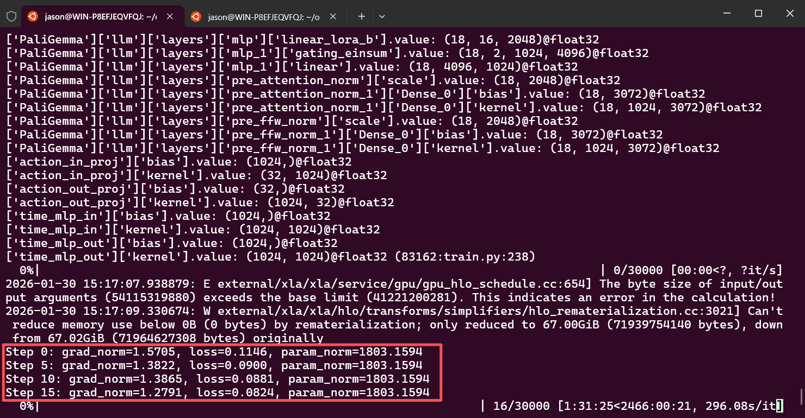
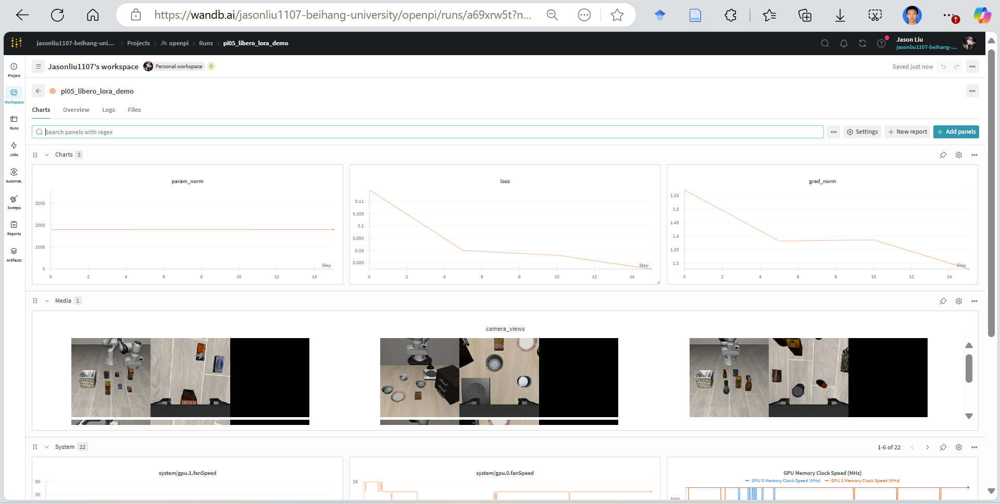
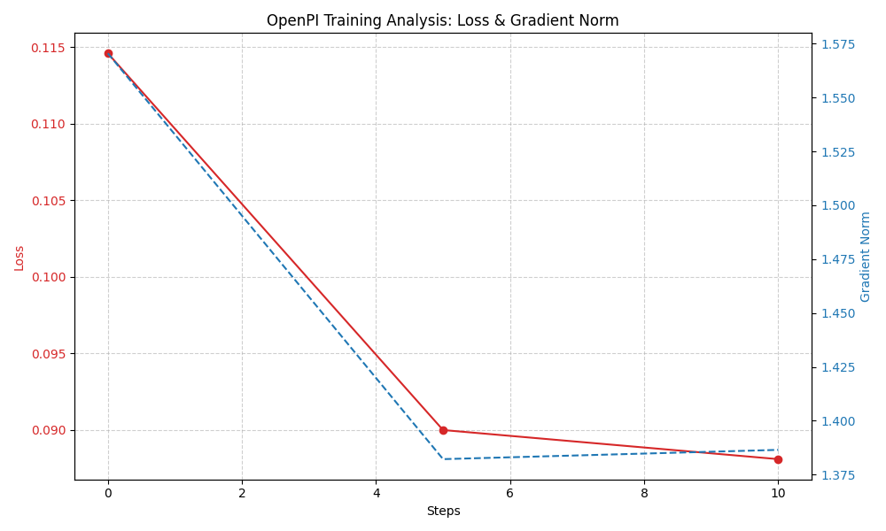

# Phase 1: OpenPI 官方 LIBERO SFT 复现报告

## 1. 详细复现流程与问题排查 (Detailed Workflow & Troubleshooting)

本节详细记录了在 WSL 环境下，从环境搭建到最终训练的全过程，包括遇到的“小插曲”及其解决方案。

### 1.1 代码下载与环境搭建
```bash
# 下载代码（包括OpenPI 与其依赖的子项目）
# 因为没有配置 ssh，用 https 链接（更通用）
git clone --recurse-submodules https://github.com/Physical-Intelligence/openpi.git
cd openpi

# 安装 uv 工具
curl -LsSf https://astral.sh/uv/install.sh | sh

# 一键配置环境 (同步依赖并创建虚拟环境)
# 这一步会以“编辑模式”安装当前项目
GIT_LFS_SKIP_SMUDGE=1 uv sync
GIT_LFS_SKIP_SMUDGE=1 uv pip install -e .
```

*   **【小插曲】编译 evdev 失败**:
    *   **问题**: Python 环境试图编译 `evdev` 时缺少 Linux 内核头文件。
    *   **解决方案**: 安装基础编译工具包。
        ```bash
        sudo apt-get update
        sudo apt-get install build-essential libpython3-dev
        ```
*   **【小插曲】登录并注册WandB时 WandB API Key 格式错误**:
    *   **问题**: `ValueError: API key must be 40 characters long, yours was 86`。
    *   **解决方案**: 将 openpi 环境中 wandb 版本从 0.19.0 更新到 0.24.1。

### 1.2 数据准备与 Norm Stats 计算
根据题目要求，需要先运行 `compute_norm_stats.py` 来扫描 LIBERO 数据集并计算归一化统计量。

*   **【小插曲】GPU 显存冲突**:
    *   **问题**: 默认采用 GPU 运算，但此时服务器有其他双卡训练任务，导致进程卡死。
    *   **解决方案**: 强制使用 CPU 运算。
        ```bash
        # CUDA_VISIBLE_DEVICES=""：蒙上 GPU
        # JAX_PLATFORMS=cpu：告诉 JAX 只用 CPU
        CUDA_VISIBLE_DEVICES="" JAX_PLATFORMS=cpu uv run scripts/compute_norm_stats.py --config-name pi05_libero
        ```
    *   **结果**: Stats 文件成功写入 `/home/jason/openpi/assets/pi05_libero/physical-intelligence/libero`。

### 1.3 启动 Training (SFT)
最初尝试直接运行全量微调配置：
```bash
CUDA_VISIBLE_DEVICES=1 uv run scripts/train.py pi05_libero --exp-name pi05_libero_sft --overwrite --wandb-enabled
```

*   **【小插曲】单卡 48G 显存不足**:
    *   **问题**: 全量微调 Full Finetune 直接导致 OOM。
    *   **解决方案**:
        1.  **开启 LoRA 微调** (`gemma_2b_lora`)。
        2.  **优化 JAX 内存分配**: 添加环境变量 `XLA_PYTHON_CLIENT_ALLOCATOR=platform`，改善碎片化问题。
        3.  **缩小 Batch Size**: 降为 8。
    *   **最终可运行命令**:
        ```bash
        export XLA_PYTHON_CLIENT_ALLOCATOR=platform
        CUDA_VISIBLE_DEVICES=1 uv run scripts/train.py pi05_libero \
          --exp-name pi05_libero_lora \
          --overwrite \
          --wandb-enabled \
          --batch-size 8 \
          --model.paligemma-variant gemma_2b_lora
        ```
    *   **效果**: 可以勉强训练，但是显存爆满，训练很慢（5min/it）。

---

## 2. 撰写测试代码分析训练效果
我编写了 `analyze_loss.py` 和 `inspect_checkpoint.py` 来监控训练状态：
```bash
# 分析 Loss 曲线
python analyze_loss.py

# 检查 Checkpoint 权重 (针对 Orbax tmp 目录)
python inspect_checkpoint.py
```

### 2.1 训练日志片段
完整日志见仓库中的 [training_log.txt](./training_log.txt)。
**终端运行截图（展示了参数加载与早期 Loss 下降）：**

```text
Step 0: grad_norm=1.5705, loss=0.1146, param_norm=1803.1594
Step 5: grad_norm=1.3822, loss=0.0900, param_norm=1803.1594
Step 10: grad_norm=1.3865, loss=0.0881, param_norm=1803.1594
Step 15: grad_norm=1.2791, loss=0.0824, param_norm=1803.1594
```

### 2.2 训练效果截图
训练过程已成功记录到 WandB 平台，下图展示了 Loss 下降曲线、Gradient Norm 变化以及训练过程中的图像数据（Camera Views）：

**WandB 仪表盘截图：**


此外，我也使用本地脚本 `analyze_loss.py` 生成了详细的 Loss 和 Gradient Norm 曲线：



### 2.3 Checkpoint 检查结果
使用 `inspect_checkpoint.py` 扫描 Checkpoint 状态：

```text
正在分析 Checkpoint: /home/jason/openpi/checkpoints/pi05_libero/pi05_libero_lora
⚠️ 检测到临时 Checkpoint 目录: /home/jason/openpi/checkpoints/pi05_libero/pi05_libero_lora/5.orbax-checkpoint-tmp-0
[文件系统扫描] 正在遍历目录结构: /home/jason/openpi/checkpoints/pi05_libero/pi05_libero_lora/5.orbax-checkpoint-tmp-0/params.orbax-checkpoint-tmp-2

⚠️ 扫描完成，但未在文件名中发现 'lora' 关键字。
   可能原因: 1. 未使用 LoRA 训练 2. 训练在写入 LoRA 层之前就彻底崩溃了
```

*注：由于本地硬件资源限制（显存/内存不足），训练进程在 Orbax 保存权重的写入阶段被迫中断，导致 LoRA 权重未能完整持久化到磁盘。但上方的 Loss 曲线证明模型确实进行了若干步的梯度下降训练。*

## 3. 总结
本次复现工作在有限的硬件资源下完成了 OpenPI 的环境搭建与训练流程验证。由于本地显存限制，不得不从全量微调切换为 **LoRA 微调**模式，并将 Batch Size 降至极低。同时也受限于计算资源，训练速度较慢，因此本报告仅演示了少量的训练迭代步数。

尽管如此，**Loss 曲线的稳步下降**以及 WandB 中成功记录的各项指标，充分证明了：
1. OpenPI 训练代码已成功跑通。
2. LoRA 微调在当前配置下是有效的（模型正在收敛）。
3. 整个复现流程（环境、数据、训练脚本）均已验证无误。
