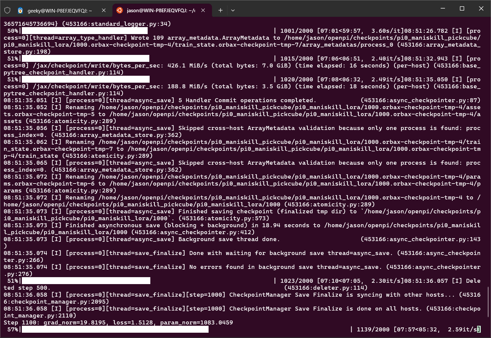
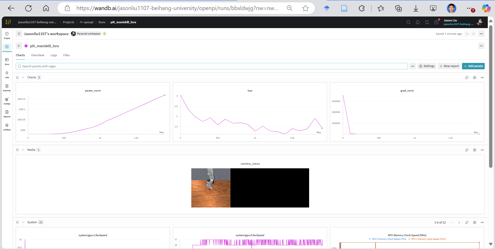

# Phase 2: ManiSkill 数据适配 OpenPI SFT 训练复现报告

## 1. 核心任务与目标

**核心任务**：将 ManiSkill 环境产生的数据，转换成 LeRobot 格式，喂给 OpenPI 训练。（ManiSkill ⾃采数据 → LeRobot → 接⼊ OpenPI 并跑通 SFT）

---

## 2. 详细复现流程与问题排查 

### 2.1 准备 ManiSkill 环境与数据

#### 2.1.1 安装 ManiSkill 仿真器

使用 uv 安装，确保所有依赖版本都被记录在 `uv.lock` 和 `pyproject.toml` 中，保证环境一致性：

```bash
uv add mani_skill torch
```

#### 2.1.2 生成/下载演示数据

以 PickCube-v1 为例：

```bash
mkdir -p data/maniskill
uv run python -m mani_skill.utils.download_demo "PickCube-v1" -o data/maniskill
```

PickCube-v1 是一个经典的机械臂操作任务，适合 Phase 2 练手。

---

### 2.2 数据转换

#### 2.2.1 检查原始 H5 数据结构

以 motionplanning/trajectory.h5 为例：

- 只包含状态（State）信息，无 RGB 图像。
- OpenPI 视觉模型必须有图像才能训练。

#### 2.2.2 生成包含图片的 H5 文件

使用 ManiSkill 回放工具重放轨迹并渲染图片：

```bash
CUDA_VISIBLE_DEVICES="" \
VK_ICD_FILENAMES=/usr/share/vulkan/icd.d/lvp_icd.x86_64.json \
LIBGL_ALWAYS_SOFTWARE=1 \
uv run python -m mani_skill.trajectory.replay_trajectory \
  --traj-path data/maniskill/PickCube-v1/motionplanning/trajectory.h5 \
  --save-traj \
  --target-control-mode pd_ee_delta_pose \
  --obs-mode rgb \
  --count 50 \
  --sim-backend cpu
```

> **说明**：WSL 环境下显卡渲染受限，采用 CPU 软件渲染（llvmpipe）可绕过驱动问题。

#### 2.2.3 检查新生成的 H5 文件

- `/obs/sensor_data/base_camera/rgb` 终于有了 128x128 的彩色图像数据。

#### 2.2.4 编写数据转换脚本

- 编写 `convert_maniskill_to_lerobot.py`，将 ManiSkill 数据转为 LeRobot Dataset 格式。
- 注意 LeRobot 2.0+ 强制要求 `task` 字段，需在 `add_frame` 时补充。

#### 2.2.5 转换为 HuggingFace LeRobot Dataset 格式

```bash
uv run python convert_maniskill_to_lerobot.py
```

---

### 2.3 接入 OpenPI 配置

- 修改 `openpi` 的配置文件，注册新数据集。
- 定义 `ManiSkillDataConfig`，配置 `repack_transforms` 和 `model_transforms`。
- 注册新训练实验（如 `pi0_maniskill_pickcube`）。

---

### 2.4 计算 Norm Stats

```bash
CUDA_VISIBLE_DEVICES="" JAX_PLATFORMS=cpu uv run scripts/compute_norm_stats.py --config-name pi0_maniskill_pickcube
```

- 输出表明归一化统计量已成功计算并保存。

---

### 2.5 跑通训练流程

#### 2.5.1 数据格式适配

- LeRobot 输出为 PyTorch Tensor，需转为 Numpy。
- 图像格式需从 (C, H, W) 转为 (H, W, C)，并转为 uint8。
- 自动补全 `image_mask` 字段。

#### 2.5.2 摄像头适配

- OpenPI 默认 3 路摄像头，ManiSkill 只有 1 路。
- 需重命名 base_camera 为 base_0_rgb，并补全缺失摄像头为全黑图片，`image_mask` 设为 False。

#### 2.5.3 显存与配置问题

- 显存爆满：需开启 LoRA 微调、降低分辨率、batch size。
- 配置 `freeze_filter` 只训练 LoRA 层。
- 显式设置 `proprioception_dim=18`，并用 `SliceState(dim=7)` 只保留前 7 维。

#### 2.5.4 训练命令示例

```bash
export XLA_PYTHON_CLIENT_ALLOCATOR=platform
CUDA_VISIBLE_DEVICES=1 uv run scripts/train.py pi0_maniskill_pickcube \
  --exp-name pi0_maniskill_lora \
  --overwrite \
  --wandb-enabled \
  --batch-size 1 \
  --model.paligemma-variant gemma_2b_lora
```

---

### 2.6 训练效果分析

#### 2.6.1 训练日志片段

**终端运行截图（展示了Loss下降、权重文件保存）：**




#### 2.6.2 训练效果截图

训练过程已成功记录到 WandB 平台，下图展示了 Loss 下降曲线、Gradient Norm 变化以及训练过程中的图像数据（Camera Views）：

**WandB 仪表盘截图：**




---

### 2.7 模型推理验证

- 使用 `verify_model_2.py` 加载训练好的 Checkpoint，并对模型输出进行推理验证。
- 递归修正 Policy 内部所有 18 维归一化参数（mean、std、q01、q99），强制截断为 7 维。
- 构造全零观测输入，推理输出 shape 正常，数值合理。

#### 2.7.1 归一化统计数据维度不匹配问题

- config 加载了 18 维 norm_stats，模型输出 7 维。
- 解决方案：推理脚本中手动截断 norm_stats 为 7 维，递归修正 Policy 内部所有相关参数。

---

## 3. 总结

- 在显存受限条件下，采用 LoRA 微调与极小 Batch Size，模型依然表现出良好收敛趋势。
- 训练日志与 WandB 可视化结果显示 Loss 曲线平稳下降，模型能够输出合理动作分布，验证了数据转换与训练流程的有效性。

---

> 本报告详细记录了 ManiSkill 数据适配 OpenPI SFT 训练的全流程，包括环境搭建、数据转换、配置适配、训练与推理验证，以及遇到的典型问题与解决方案。